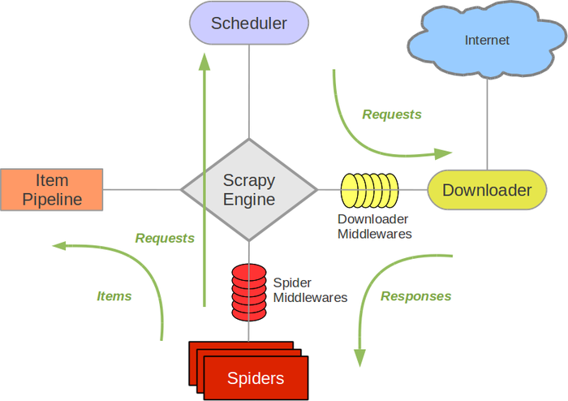

## 浏览器版本映射关系  

|Chromedriver 版本|支持的Chrome版本|
|:---:|:---:|
|v2.43|v69-71|
|v2.42|v68-70|
|v2.41|v67-69|
|v2.40|v66-68|


## 准备

#### 环境
```
python > 3.5
```
#### 升级 `pip` 包管理工具  

```python
python -m pip install --upgrade pip
```
> 如果版本低于2.7，需要升级管理工具，查看版本 `python --version`

#### 安装 selenium webdriver

```python
pip install selenium
```

#### 安装 PyMySQL（非必须）

```python
python -m pip install PyMySQL
```

#### 安装 remi（非必须）

```python
pip install remi
```

#### 启动浏览器

```python
from selenium import webdriver

dr = webdriver.Chrome()
```

#### 关闭浏览器  

```python
time.sleep(2)
print 'browser will be closed'
dr.quit() # or dr.close()
print 'browser is closed'
```
> 关闭浏览器有两种方式  
>> 1、`close`方法  
>> 2、`quit`方法

#### 浏览器最大化  

如果在 `webdriver` 测试中使用了 `sikuli` 来对 `flash` 插件进行操作的话，把浏览器最大化无疑是一个比较简单的保证分辨率统一的解决方案。 

```python
dr.maximize_window()
```

#### 设置浏览器大小  

```python
dr.set_window_size(240, 320)
dr.get('http://www.3g.qq.com')
```

#### 访问链接  

```python
url = 'http://www.baidu.com'
print "now access %s" %(url)
dr.get(url)
```

#### 打印当前页面的title及url    

```python
print "title of current page is %s" % (driver.title)
print "url of current page is %s" % (driver.current_url)
```

#### 处理原生的js alert confirm 以及prompt

具体思路是使用switch_to.alert()方法定位到alert/confirm/prompt。然后使用text/accept/dismiss/send_keys按需进行操做 
* text。返回alert/confirm/prompt中的文字信息
* accept。点击确认按钮
* dismiss。点击取消按钮，如果有的话
* send_keys。向prompt中输入文字

## 自动登录安装列表 

#### 安装PIL包

```
下载地址：https://www.lfd.uci.edu/~gohlke/pythonlibs/#pillow
安装
D:\Git\pay-auto-test> pip install D:\python2.7\Scripts\Pillow-5.3.0-cp27-cp27m-win_amd64.whl
Processing d:\python2.7\scripts\pillow-5.3.0-cp27-cp27m-win_amd64.whl
Installing collected packages: Pillow
Successfully installed Pillow-5.3.0
```
#### tesseract-ocr　安装

https://github.com/tesseract-ocr/tesseract/wiki/4.0-with-LSTM#400-alpha-for-windows

#### pytesseract 安装

```
pip install pytesseract
```
## Remi is a GUI library

[https://github.com/dddomodossola/remi](https://github.com/dddomodossola/remi) 

## 功能
* 日志系统使用 
    ```
    from log import logger
    x = logger.logger()
    x.error("这是一个 error 级别的问题！")
    ```
## 基础语法
* List（列表）
  * 列表是写在方括号 [] 之间、用逗号分隔开的元素列表。  
  * 类型可以不相同，它支持数字，字符串甚至可以包含列表（所谓嵌套）  
  * 和字符串一样，列表同样可以被索引和截取，列表被截取后返回一个包含所需元素的新列表。  
  * 索引值以 0 为开始值，-1 为从末尾的开始位置。  
  * List中的元素是可以改变的  
* Tuple（元组））
  * 元组的元素不能修改。元组写在小括号 () 里，元素之间用逗号隔开。  
  * 和字符串一样，列表同样可以被索引和截取，列表被截取后返回一个包含所需元素的新列表。  
  * 索引值以 0 为开始值，-1 为从末尾的开始位置。  
  * List中的元素是可以改变的  
* is 用于判断两个变量引用对象是否为同一个， == 用于判断引用变量的值是否相等。

* 类型区别
    * 列表：清单可重复，类型可不同 list，例如：`['10','15','200']`
    * 元组: 类似列表不可修改类型  tuple，例如：`('10','15','200')`
    * 集合：就是我们数学学的集合应用是去重 set，例如：`{'apple', 'orange', 'apple', 'pear', 'orange', 'banana'}`
    * 字典：字典存储键值对数据价值是查询，通过键，查找值 dict，例如：`{"name":"Tinywan","age":24,"schoole":"QH"}`
* 字符串与列表的相互转换
    * 字符串转列表
        ```
        str1 = "hi hello world"
        print(str1.split(" ")) # 输出：['hi', 'hello', 'world']
        ```
    * 列表转字符串
        ```
        l = ["hi","hello","world"]
        print(" ".join(l)) # 输出： hi hello world
        ``` 
* 类 
    * 属性  
      尽量把需要用户传入的属性作为实例属性，而把同类都一样的属性作为类属性。实例属性在每创造一个实例时都会初始化一遍，不同的实例的实例属性可能不同，不同实例的类属性都相同。从而减少内存。
        * 实例属性 ：最好在__init__(self,...)中初始化，内部调用时都需要加上self. 
        * 类属性：在__init__()外初始化。在内部用classname.类属性名调用，外部既可以用classname.类属性名又可以用instancename.类属性名来调用    
        * 私有属性
          * 单下划线_开头：只是告诉别人这是私有属性，外部依然可以访问更改   
          * 双下划线__开头：外部不可通过instancename.propertyname来访问或者更改      
          * 实际将其转化为了_classname__propertyname      
    * 方法    
      尽量把需要用户传入的属性作为实例属  
        * 普通类方法 ：外部用实例调用  
            ```
            def fun_name(self,...):
                pass
            ```
        * 静态方法：`@staticmethod`。不能访问实例属性。参数不能传入self。与类相关但是不依赖类与实例的方法
        * 类方法：`@classmethod` 
          * 不能访问实例属性。 参数必须传入cls
          * 必须传入cls参数（即代表了此类对象-----区别------self代表实例对象），并且用此来调用类属性：cls.类属性名  
          * 静态方法与类方法都可以通过类或者实例来调用。其两个的特点都是不能够调用实例属性  

## 类库
* BeautifulSoup         
```python
pip install beautifulsoup4 

# 安装解析器
pip install lxml
pip install html5lib
```

##  [Scrapy](https://github.com/scrapy/scrapy)
爬取网站数据、提取结构性数据而编写的应用框架


## 错误信息         
```
TypeError: Unicode-objects must be encoded before hashing
```
> str.encode("utf-8")

```
UnboundLocalError: local variable 'params_str' referenced before assignment
```
> 本地变量xxx引用前没定义,在于python没有变量的声明 , 所以它通过一个简单的规则找出变量的范围 ：如果有一个函数内部的变量赋值 ，该变量被认为是本地的，所以如果有修改变量的值就会变成局部变量。

在windows下，在dos中运行pip install Scrapy报错：
```
error: Microsoft Visual C++ 14.0 is required. Get it with "Microsoft Visual C++ Build Tools"
```
解决方案 : 
* [http://www.lfd.uci.edu/~gohlke/pythonlibs/#twisted](http://www.lfd.uci.edu/~gohlke/pythonlibs/#twisted) 下载twisted对应版本的whl文件 
* 这里下载的为：`Twisted-18.9.0-cp37-cp37m-win_amd64.whl`,复制到`D:\python3.7\Scripts`目录中
* cp后面是python版本,运行命令：`pip install D:\python3.7\Scripts\Twisted-18.9.0-cp37-cp37m-win_amd64.whl`
* 安装完成后，再次运行：`pip install Scrapy`

错误：`No matching distribution found for win32api`
```
pip install pypiwin32
```

#### HELP

* [https://github.com/easonhan007/webdriver_guide](https://github.com/easonhan007/webdriver_guide)   

